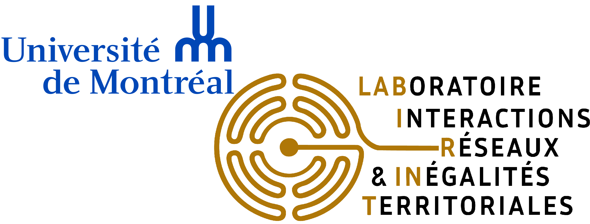

::: menu-vertical
[Accueil](index.qmd)

[Membres](membres.qmd)

[Projets](projets.qmd)

[Intégrer le LABIRINT](maitrise.qmd)
:::

{width="624"}

## Qu'est-ce que le LABIRINT ?

Le LABoratoire pour l'analyse des Interactions, des Réseaux et des INégalités Territoriales (LABIRINT) est un laboratoire de recherche en Sciences des données spatiales, Systèmes d'Informations Géographiques (SIG) et Géographie humaine du [département de géographie de l'Université de Montréal](https://geographie.umontreal.ca/accueil/) (UdeM). Coordonné par le professeur [Thibault Le Corre](https://geographie.umontreal.ca/repertoire-departement/professeurs/professeur/in/in36582/sg/Thibault%20Le%20Corre/), le LABIRINT regroupe principalement des étudiant·es du département qui y mènent leur recherche.

L'objectif du LABIRINT est de favoriser l'émergence de recherches en Sciences Humaines et Sociales avec une dimension spatiale et qui adoptent des méthodes mixtes de la recherche, en privilégiant notamment la dimension quantitative, l'analyse spatiale et l'analyse de réseaux. Les recherches menées par le LABIRINT sont éclectiques tout en ayant l'objectif commun de comprendre et d’interroger diverses dynamiques territoriales, en particulier dans les espaces urbains.

## Contact

Campus MIL – Complexe des sciences. Local B-5347

1375, avenue Thérèse-Lavoie-Roux, Montréal, QC H2V 0B3

Adresse courriel : [thibault.le.corre\@umontreal.ca](thibault.le.corre\@umontreal.ca)

Téléphone bureau : (514)-343-6111 #13986
