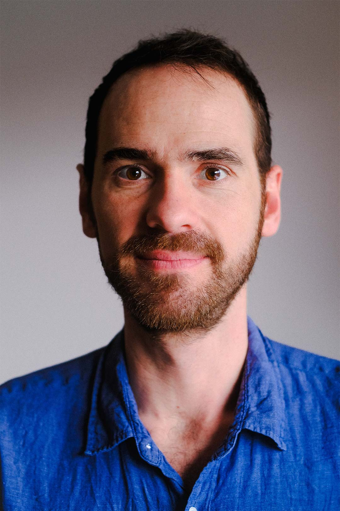
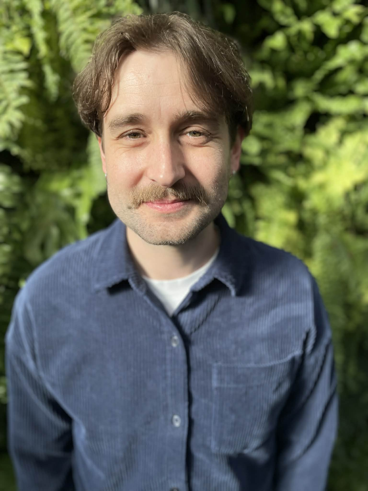
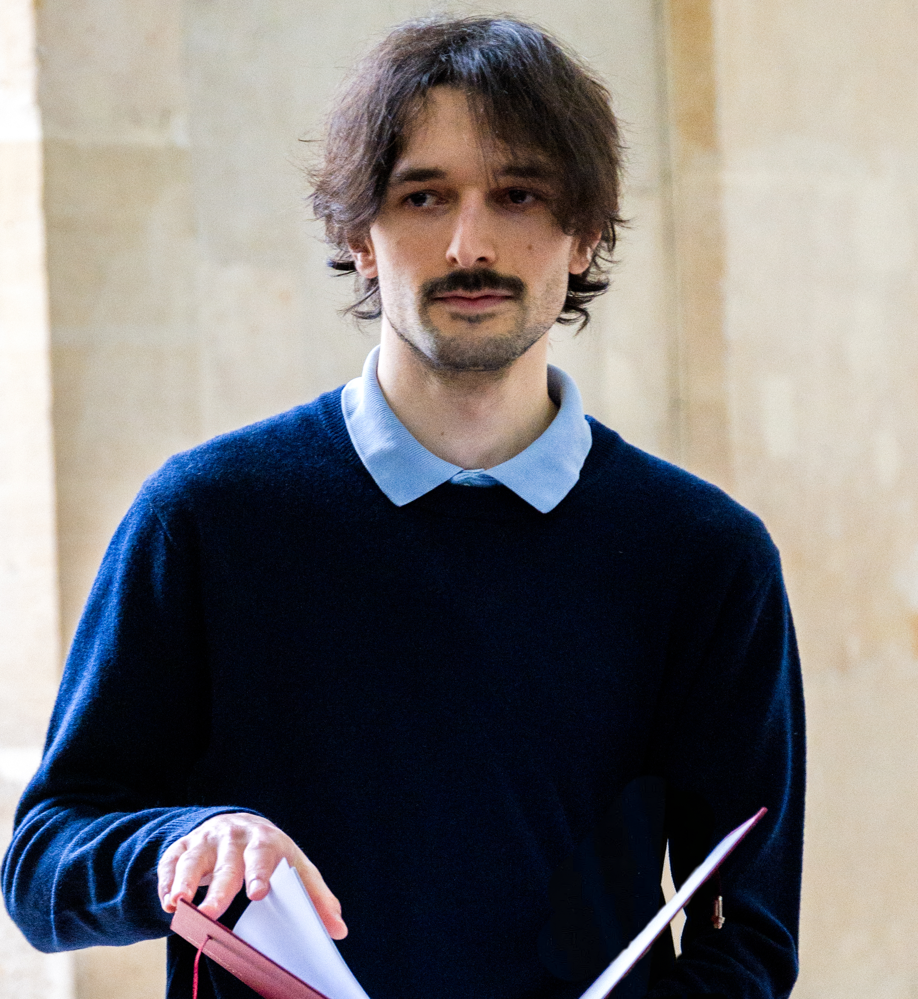

<!-- ::: menu-vertical -->
<!-- - [Accueil](index.qmd) -->
<!-- - [Les membres](membres.qmd) -->
<!-- - [Nos projets](projets.qmd) -->
<!-- - [Rejoindre le LABIRINT](maitrise.qmd) -->
<!-- ::: -->

## Qui sommes-nous ?

Nous sommes tous.tes des membres du département de géographie de l'Université de Montréal.

::: {.columns}

::: {.column width="20%"}
{style="margin-top: 30px;"}
:::

::: {.column width="75%"}
### Thibault Le Corre -- Directeur du laboratoire

Je suis docteur en géographie de l'Université Paris 1 Panthéon-Sorbonne et  professeur adjoint à l'Université de Montréal depuis septembre 2023. Mes activités d'enseignement sont principalement dédiés aux SIG et à la géographie humaine. Mon travail de recherche est principalement consacré à l'analyse des dynamiques des marchés immobiliers et à leurs répercussions sur les inégalités sociales et spatiales. Je m'intéresse également aux nouvelles géographies du travail et aux dynamiques de division sociale des espaces urbains associées. J'ai fondé le LABIRINT dans l'objectif d'accroître la visibilité de mes étudiant.es et de diffuser plus facilement nos recherches en géographie humaine.
:::

:::
### Etudiant.es en maîtrise

::: {.columns}

::: {.column width="20%"}
{style="margin-top: 10px;"}
::: 

::: {.column width="75%"}
Je suis étudiant à la maîtrise en géographie à l'UdeM pour mener une recherche sur la géographie de la Commune. Avant cela, j'ai fait une licence en géographie et une une première année de maîtrise spécialisée dans la culture et le patrimoine en France. J'ai aussi suivi les cours du DESS en géomatique de l'UdeM. Dans mon parcours professionnel et personnel j'ai acquis des compétences en développement Web et en codage créatif. Mes intérêts sont la géographie humaine et sociale et les enjeux géopolitiques locaux et globaux. Je m'intéresse aussi à l'analyse et à la visualisation de données.
:::

::: {.column width="20%"}
{style="margin-top: 10px;"}
::: 

::: {.column width="75%"}
Diplômée d'un baccalauréat en géographie environnementale de l'Université de Montréal (2023-2026), j'entame mon parcours aux cycles supérieurs avec un intérêt marqué pour les études urbaines, notamment la fabrique urbaine, la justice spatiale et le droit à la ville. Ma curiosité académique s'est développée dès mon parcours au secondaire au sein du Programme d'éducation intermédiaire, puis s'est approfondie lors de ma troisième année au baccalauréat à travers un projet de recherche d'envergure réalisé dans le cadre du cheminement Honor. En parallèle du monde académique, l'acquisition et le partage de connaissances motivent mes engagements professionnels, notamment à titre d'auxiliaire d'enseignement et d'instructrice dans différents sports. Ces expériences, tout comme la pratique des sports d'endurance, nourrissent ma curiosité, ma passion, ma persévérance et ma discipline, qui guident ma quête de dépassement tant sur le plan personnel que professionnel. 
::: 

::: {.column width="20%"}
{style="margin-top: 10px;"}
::: 

::: {.column width="75%"}
Je suis étudiant étudiant à la maîtrise au département de géographie de l'UdeM. Je suis également diplômé d'État de l'École nationale supérieure d'architecture de Versailles. Au cours de cette formation je me suis intéressé aux productions mémorielles issues des inégalités systémiques. J'ai notamment réalisé une installation documentaire intitulée « Nos Mort.e.s », ou encore un projet cartographique « Un foncier parisien possible » qui illustre le gradient de publicité qui sépare les citoyens des strates administratives et de leurs espaces, et qui imagine une pratique alternative de l'architecture publique. Plus récemment, je me suis penché sur la dimension spatiale de la mémoire ordinaire et de ses inégalités par l'étude historique et micro-géographique du cimetière de Saint-Denis, en France. Je réalise actuellement une maîtrise sur les commerces de courte durée et les dynamiques de gentrification à Montréal.
::: 

:::